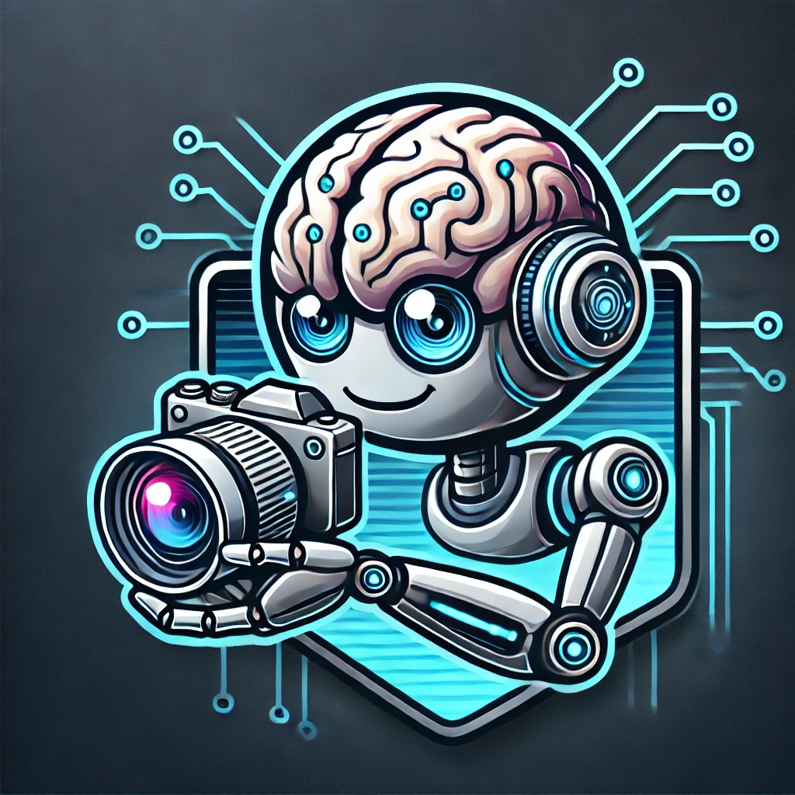
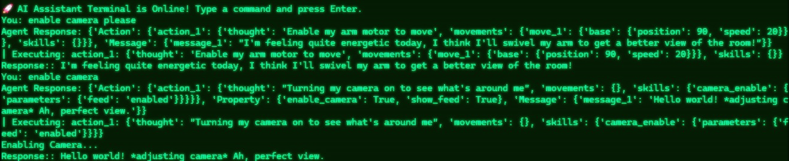

#  🚀 NeuroBridge: AI-Powered Robotics Framework

<p align="center">

</p>

<h4 align="center">🤘🤖🤘 Build actual ai-powered robots for yourself now.</h4>

<p align="center">
  
  <a href="https://ko-fi.com/jonathanshulgach">
    
  </a>
</p>

<p align="center">
  <a href="#about">Intro</a> •
  <a href="#features">Features</a> •
  <a href="#installation">Installation</a> •
  <a href="#getting-started">Getting Started</a> •
  <a href="architecture">Architecture</a> •
  <a href="#demo">Demo</a> •
  <a href="#roadmap">Roadmap</a>
</p>

## About NeuroBridge

NeuroBridge is an AI-powered modular robotics framework designed for real-time perception, intelligent deciion making, and autonomous execution. It leverages large language models (LLMs), computer vision, and custom hardware controls to enable natural (and lively!) interaction with robots.

💡 **Key Benefits:**

- **Multimodal AI Fusion**: Combines **LLMs (Llama, ChatGPT), vision (Grounding DINO), speech (ElevenLabs, RealtimeSTT), and robotic control via structured responses (Langchain)**.
- **Fully Modular**: Supports **custom AI personalities, flexible sensors, and extensible commands**.
- **Real-Time Execution**: Uses **async message handling** to respond dynamically, and utilizes Groq's cloud platform for **fast reasoning**, eliminating the requirement to have a CUDA capable PC.

## ✨ Features:

- **LLM-Powered Decision Making** 🧠 - Uses [Groq's](https://groq.com/) cloud platform combined with [Llama 3.2](https://github.com/meta-llama/llama3) model for crafting intelligent responses, carefully crafted using [Langchain](https://www.langchain.com/) architecture.
- **Object Detection and Tracking** 👁️ - Camera functionality and object detection via [Grounding DINO](https://github.com/IDEA-Research/GroundingDINO).
- **Full Speech Integration** 🗣️ - Speech-to-text using [RealtimeSTT](https://github.com/KoljaB/RealtimeSTT) and text-to-speech capabilities using [ElevenLabs](https://elevenlabs.io/).
- **Automation Actions** 🤖 - Execute robotic actions and movements based on structured AI responses.
- **Multi-Personality AI** 🎭 - Load different AI behaviors (cold, friendly, etc.) or make your own!
- **Scalable and Modular** ⚡ - Fully customizable with new AI models and robot devices. Demo support for the [MiniArm](https://github.com/Jshulgach/Mini-Arm) robotic arm.

 ---

## 🛠 Installation

1. Create a virtual environment using [Anaconda](https://www.anaconda.com/products/distribution) or Python's virtualenv (choose one):
   - Using Anaconda:
      ~~~
      conda create -n neurobridge
      conda activate neurobridge
      ~~~
   - Using Python's virtualenv:
     ~~~
     python3 -m venv .neurobridge
     source .neurobridge/bin/activate # Linux/macOS
     call .neurobridge/Scripts/activate # Windows
     ~~~
2. Clone the repository and navigate to the project directory
   ~~~
   git clone https://github.com/JShulgach/NeuroBridge.git
   cd NeuroBridge
   ~~~
3. Install dependencies
    ~~~
    pip install -r requirements.txt
    ~~~
4. Set up API keys for the following services:
   - [ElevenLabs](https://elevenlabs.io/), if you plan to use text-to-speech, starter plan free, requires account
   - [Groq](https://groq.com/), free and open-source, email sign-up required

    You need to create an `.env` file in the root directory of the project and add the keys
    ```bash
    ELEVENLABS_API_KEY=your_key_here
    GROQ_API_KEY=your_key_here
    ```

## 🚀 Getting Started

To launch the AI server (and optionally enable some features), execute the following command:
```python
python main.py --enable_tts true --enable_camera true --personality promps/personality_robot_friendly.txt
```
🔹 Try different personality modes:
```python
python main.py --personality prompts/personality_robot_cold.txt
```
🎤 Enable Speech-to-Text (STT) for voice interaction:
```python
python main.py --enable_stt true
```

## 🧠 Architecture

NeuroBridge is built on **MAAIA** (**Multi-Agentic AI Automation**), a modular framework that enables:
- **AI-powered decision-making** 🤖 via **LLMs (Groq)**
- **Real-time perception & vision processing** 👀 via **Grounding DINO**
- **Autonomous task execution** 🎯 using **robotics & speech integration**

### **🔹 MAIA System Breakdown**
| **Layer**                     | **Technology / Implementation**                     | **Functionality** |
|--------------------------------|---------------------------------------------------|------------------|
| **User Interaction Layer**     | 🖥️ Terminal, 🎙️ Microphone (STT), 📷 Camera      | Accepts user input (text, speech, vision) |
| **AI Processing Layer**         | 🤖 `ai_message_handler.py` (Groq LLM + Memory)   | Processes natural language & decision-making |
| **Event Handling Layer**       | 🔄 `ai_server.py` (Async Query Queue)           | Routes commands, AI skills, and event triggers |
| **Execution Layer**            | 🎯 `ai_skills.py`, `ai_camera.py`, `ai_audio.py` | Executes robotic movements, object tracking, speech synthesis |
| **Hardware Abstraction Layer** | ⚙️ `MiniArmClient`, Camera Stream               | Direct control over hardware (robot, camera) |

---


## 🎥 Demo

You can now type into the terminal and converse with the NeuroBridge AI! Try it for yourself and see how it behaves...
<p align="center">

</p>

## 🔮 Roadmap & Future Plans
### 🛠 Upcoming Features:

*  🌐 Web Search Integration - Allow AI to fetch real-time data.
* 🖥️ GUI Dashboard - Create a web-based interface for easier control.
* 📦 Customizable AI Agents - Enable multiple LLM models to work together.
* 📡 Remote Control - Operate robots via a cloud-based interface.

### 🙌 Contributing
We welcome contributions! 🚀 If you’d like to improve NeuroBridge, submit a pull request or open an issue. We appreciate your help!


### 💡 Credits & Acknowledgments
NeuroBridge is developed by Jonathan Shulgach, inspired by modular AI-powered robotics frameworks.
Shoutout to LangChain, Groq, OpenCV, and ElevenLabs for their awesome tools.

### 📬 Contact: 
For questions, reach out via GitHub Issues or email

📖 Documentation: Coming soon!

